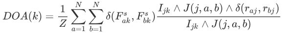

# Neural Cognitive Diagnosis for Intelligent Education Systems

Source code and data set for the paper [Neural Cognitive Diagnosis for Intelligent Education Systems](http://staff.ustc.edu.cn/~qiliuql/files/Publications/Fei-Wang-AAAI2020.pdf) and [NeuralCD: A General Cogntive Diagnosis Framework](https://ieeexplore.ieee.org/abstract/document/9865139).

The code in this repository is the implementation of NeuralCDM model, and the data set is the public data set [ASSIST2009-2010](https://sites.google.com/site/assistmentsdata/home/assistment2009-2010-data/skill-builder-data-2009-2010
).

If this code helps with your studies, please kindly cite the following publication:

```
@article{wang2020neural,
  title={Neural Cognitive Diagnosis for Intelligent Education Systems},
  author={Wang, Fei and Liu, Qi and Chen, Enhong and Huang, Zhenya and Chen, Yuying and Yin, Yu and Huang, Zai and Wang, Shijin},
  booktitle={Thirty-Fourth AAAI Conference on Artificial Intelligence},
  year={2020}
}
```

or

```
@article{wang2022neuralcd,
  title={NeuralCD: A General Framework for Cognitive Diagnosis},
  author={Wang, Fei and Liu, Qi and Chen, Enhong and Huang, Zhenya and Yin, Yu and Wang, Shijin and Su, Yu},
  journal={IEEE Transactions on Knowledge and Data Engineering},
  year={2022},
  publisher={IEEE}
}
```

For the implementation of NeuralCDM+, please refer to  https://github.com/LegionKing/NeuralCDM_plus .

For the implementation of KaNCD (in "NeuralCD: A General Cogntive Diagnosis Framework") and other typical cognitive diagnosis models, please refer to our github repository: https://github.com/bigdata-ustc/EduCDM .


## Dependencies:

- python 3.6
- pytorch >= 1.0 (pytorch 0.4 might be OK but pytorch<0.4 is not applicable)
- numpy
- json
- sklearn


## Usage

Run divide_data.py to divide the original data set data/log_data.json into train set, validation set and test set. The data/ folder has already contained divided data so this step can be skipped.

`python divide_data.py`

Train the model:

`python train.py {device} {epoch}`

For example:

`python train.py cuda:0 5`  or `python train.py cpu 5`

Test the trained the model on the test set:

`python predict.py {epoch}`


## Data Set

The data/log_data.json is extracted from public data set [ASSIST2009-2010](https://sites.google.com/site/assistmentsdata/home/assistment2009-2010-data/skill-builder-data-2009-2010) (skill-builder, corrected version) where `answer_type != 'open_response' and skill_id != ''`. When a user answers a problem for multiple times, only the first time is kept. The logs are organized in the structure:

- log_data.json = [user1, user2, ...]
- user = {"user_id": user_id, "log_num": log_num, "logs": [log1, log2, ...]]}
- log = {"exer_id": exer_id, "score": score, "knowledge_code": [knowledge_code1, knowledge_code1, ...]}


The user_id, exer_id and knowledge_code correspond to user_id, problem_id and skill_id attributes in the original ASSIST2009-2010 csv file. The ids/codes are recoded starting from 1.


## Details

- Students with less than 15 logs would be deleted in divide_data.py.
- The model parameters are initialized with Xavier initialization.
- The model uses Adam Optimizer, and the learning rate is set to 0.002.


## Correction

There is a mistake in the AAAI conference paper. Eq. (18) should be:

